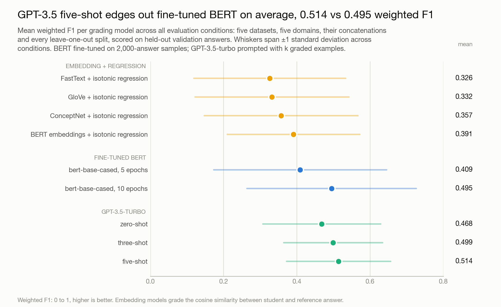
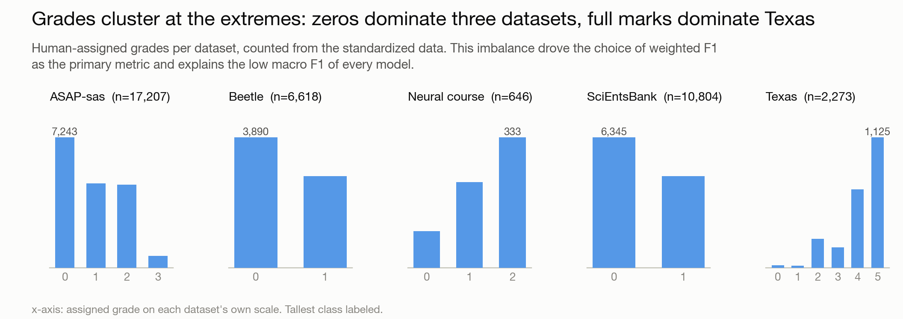
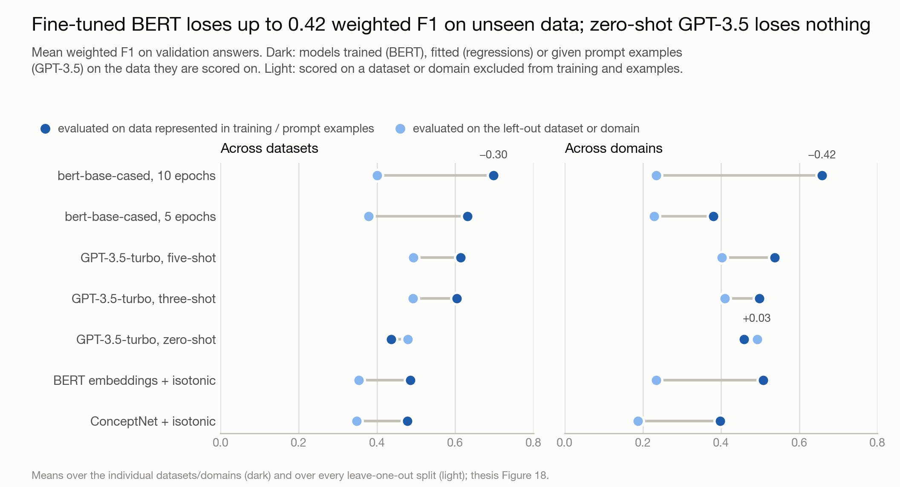
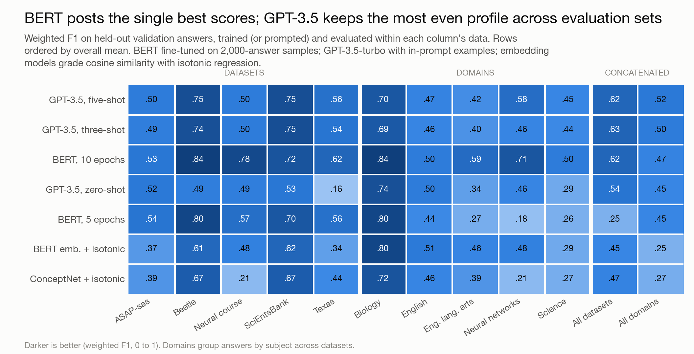
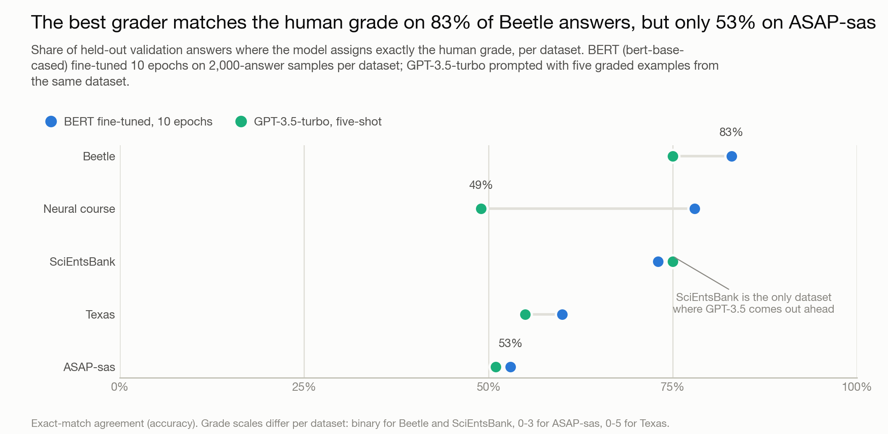

# Grading student answers with BERT, GPT-3.5 and embedding models

MSc thesis project, Information Science (Data Science track), University of Amsterdam, 2023.
I compared three generations of automated short-answer grading models on five public
datasets under one shared evaluation protocol: 37,548 graded student answers, 4,871 logged
experiment runs.



| Model, best configuration | Mean weighted F1, all conditions | Best single set | Unseen datasets | Unseen domains |
|---|---|---|---|---|
| GPT-3.5-turbo, five-shot | 0.514 | 0.75 | 0.493 | 0.402 |
| BERT fine-tuned, 10 epochs | 0.495 | **0.84** | 0.400 | 0.234 |
| GPT-3.5-turbo, zero-shot | 0.468 | 0.74 | 0.479 | **0.492** |
| BERT embeddings + isotonic regression | 0.391 | 0.80 | 0.354 | 0.234 |

Weighted F1 on held-out validation answers; "unseen" means the dataset or domain was left
out of training and prompt examples entirely. The difference between the top two rows is
not statistically significant; the transfer gap is. The full thesis with all tables is at
[docs/thesis.pdf](docs/thesis.pdf).

## The problem

Grading short open-answer questions is one of the most time-expensive parts of teaching,
and the research field that automates it had a comparability problem: every paper reported
on its own dataset with its own metric, RMSE here, quadratic weighted kappa there, F1
somewhere else. You could not tell whether a fine-tuned BERT from one paper actually beat
the feature-based system from another. I built one pipeline that standardizes five public
datasets into one schema and pushes three very different model families through identical
splits, samples and metrics, so the comparison is direct.

## The data dictated the setup

Five datasets: ASAP-sas (17,207 answers), SciEntsBank (10,804), Beetle (6,618),
Texas-2011 (2,273) and a neural-network course exam (646). Sources and download
instructions are in [data/README.md](data/README.md); none are redistributed here.



Two findings from exploration shaped everything downstream. First, grades cluster hard at
the extremes: zero is the most common grade in three datasets, full marks in Texas. That
imbalance rules out plain accuracy and macro F1 as headline metrics, so weighted F1 became
the primary measure, with RMSE and Pearson correlation kept for comparability with earlier
papers. Second, ASAP-sas ships no reference answers, so I synthesized one per question:
embed all full-score student answers with TF-IDF, take the answer closest to their
centroid. Grades were normalized to [0, 1] by each question's maximum points so models
train on one scale, then converted back before scoring.

## One protocol for every model

Every experiment uses the same 70-20-10 train/test/validation splits (seed 42) and reports
on the validation set. Four conditions: within each dataset, within each domain, on
concatenated data, and leave-one-out, where a model trains on the concatenation minus one
dataset or domain and is evaluated on what it never saw. To keep the comparison fair to
models with very different compute costs, BERT experiments sample 2,000 answers per
condition (1,400 train, 400 test, 200 validation), and the LLM grades the same validation
answers. Differences are tested with Kruskal-Wallis and Dunn's post-hoc with Bonferroni
correction, after Shapiro-Wilk ruled out parametric tests.

## Baselines: an embedding plus a regression

I started with the most interpretable family, replicating the setup of Gaddipati et al.
(2020): embed student and reference answer (FastText, GloVe, ConceptNet or BERT token
embeddings), take the cosine similarity, and map similarity to a grade with a regression.
Twenty-four variants: four embeddings, summed or averaged, times three regressions
(linear, ridge, isotonic).

The results came out flat. Mean weighted F1 runs from 0.304 to 0.391, no
regression choice differs significantly from another, and summing versus averaging
changes nothing. BERT token embeddings with isotonic regression came out best at 0.391,
and no amount of shuffling the pieces moved it. Whatever these models were missing, it
was not the choice of regressor. That pointed the next step at models that read the
answer pair as a whole.

## Fine-tuned BERT: the highest peaks, the worst travel

bert-base-cased with a regression head, fine-tuned per condition on the 2,000-answer
samples for 5 and 10 epochs. This is the family that produced the study's best single
numbers: 0.84 weighted F1 on Beetle and on the biology domain at 10 epochs, and it matched
the human grade on 83% of Beetle validation answers. On ASAP-sas at 10 epochs it reached
RMSE 0.724 and Pearson 0.620; against the published BLSTM baseline on that dataset this is
a better error but a weaker correlation, a pattern that held for every model in the study.

Then it had to transfer. On leave-one-out datasets the mean drops from 0.698 to 0.400; on
leave-one-out domains from 0.658 to 0.234, including a flat 0.00 weighted F1 on the
left-out biology domain, the same domain where it scores 0.84 when trained on it. Ten
epochs of fine-tuning bought accuracy on the training distribution and paid for it in
generalization.



## GPT-3.5-turbo: the flattest profile, and examples can hurt

The LLM entered as the opposite bet: no training at all, just a grading instruction with
zero, three or five graded examples in the prompt, predicting on the original grade scale
(a quick test showed normalized targets made it worse). It never hit BERT's peaks, but its
scores barely move across datasets: the interquartile range of its weighted F1 is 0.151
to 0.186 across shot counts, against 0.241 for BERT at 10 epochs and 0.332 at 5.

More examples helped on average (0.468, 0.499, 0.514 for zero, three, five shots) but the
trend is not statistically significant, and it inverts on unseen domains: zero-shot scores
0.492 there, while three and five shots with examples from other domains drop to 0.410 and
0.402. Examples from the wrong distribution are not neutral, they actively mislead the
grader. One more thing shipped with these numbers: the prompt asked the model to return
"a single howl number". The typo shipped to the API in every call, GPT-3.5 graded on
regardless, and it is preserved in this repository exactly as it ran.

## What did not make the thesis

Two dead ends and one collapse are part of the record. I fine-tuned GPT-2 for grading
(notebook 03): 76.8% accuracy on Beetle, promising but strictly worse than BERT for the
same cost, so it never scaled past one dataset. I tried DistilBERT and frozen-layer BERT
variants to cut training cost: mean accuracy 0.40 across runs against 0.50 for full BERT,
dropped from the paper. And macro F1 collapsed for every model on the imbalanced datasets,
which is the class-imbalance finding from exploration showing up exactly where it was
predicted to.

## Where the models meet real grading





Read as a deployment decision, the two headline models split cleanly. Grading answers
for a course you have historical data for: fine-tuned BERT, which agrees exactly with the
human grader on up to 83% of answers. Grading a new exam type, a new subject, or anything
without 2,000 labeled answers lying around: GPT-3.5, which holds near its average
everywhere, including data nothing was trained on. The embedding baselines lose on both
axes, but they remain the only family where you can point at the cosine similarity and
explain a grade.

## Lessons

1. The protocol is the contribution. Identical splits and metrics made three incomparable
   literatures directly comparable, and most of the engineering effort went there.
2. Peak accuracy and transferability are different properties. Ranking models on one
   number hides the axis that decides real deployments.
3. More context is not automatically better for an LLM. Examples from the wrong domain
   measurably hurt.
4. Log everything, append-only. The 29-column run log (4,871 rows) is why every number
   here could be traced and verified three years later, after the laptop that ran the
   experiments died.
5. Look at the label distribution before choosing a metric. Every later result, including
   the macro F1 collapse, was already visible in the grade histograms.

## Repository

```
main.py, constants.py     pipeline entry: toggle phases, then python main.py
data/                     staged data pipeline (raw -> standardized -> splits -> model prep)
grading_models/           regression, BERT fine-tuning, OpenAI API grading
performance_tracking/     run logging and metrics (the 29-column schema)
notebooks/01..06          EDA, baseline replication, GPT-2, GPT-3.5, BERT, results analysis
results/                  recovered run-log snapshot and what survived of the tracking data
assets/                   charts embedded above
docs/thesis.pdf           the full thesis
```

To rerun: `conda env create -f environment.yml`, place the datasets as described in
[data/README.md](data/README.md), enable phases in `constants.py`, `python main.py`.
The environment file pins the closest working versions of the 2023 stack (the original
environment was lost); the data pipeline and notebook 01 are verified end to end against
it. GPT-3.5 results are a 2023 snapshot of a since-retired model version and are not
exactly reproducible; all other numbers come from the saved outputs in notebook 06 and
the thesis.
